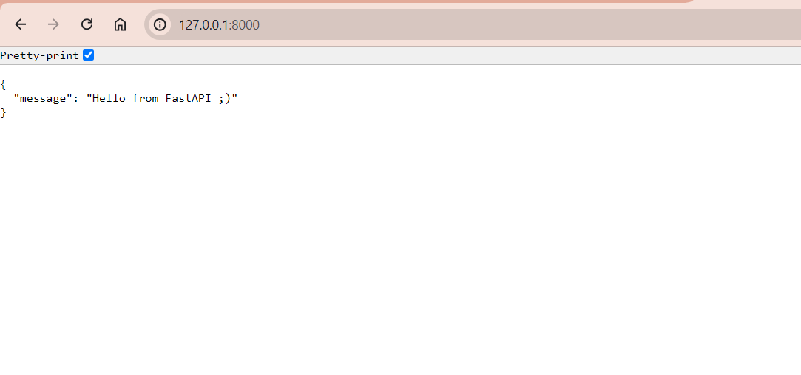

# docker-fastapi-test

1: Cloning the given repository to local machine
   Open VS code > Clone a repository > Select or create file > clone the repo

2: Go to project directory > cd docker-fastapi-test

3: Setting Virtual Environment 
   Install python and check the version
   then create the virtual environment by command > python -m venv venv
   To activate the environment > ./venv/Scripts/activate

4: Install Requirements > pip install -r requirements.txt

5: To run the application 
   command: uvicorn app.main:app

6: Create Dockerfile
   # Use an official Python runtime as a parent image
   FROM python:3.12.4

   # Set the working directory in the container
   WORKDIR /the/workdir/path

   # Copy requirements.txt into the container at /the/workdir/path
   COPY requirements.txt ./

   # Install dependencies listed in requirements.txt
   RUN pip install --no-cache-dir --no-deps -r requirements.txt

   # Copy the rest of the application code into the container at /the/workdir/path
   COPY . .

   # Command to run the FastAPI app using Uvicorn
   CMD ["uvicorn", "app.main:app", "--host", "0.0.0.0", "--port", "8000"]

7: Create a docker-compose.yml file
   version: '3.8'
services:
  web:
    build: .
    ports:
      - "8000:8000"
    volumes:
      - .:/code
    command: uvicorn main:app --host 0.0.0.0 --port 8000

8: To build the yml file
   docker-compose up -d --build
   docker-compose build --no-cache

9: Then run the docker container
   To build docker image > docker build -t app

